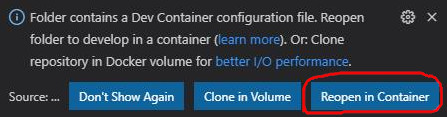

# Go snippets

## Requirements

either 
- Docker
- VSCode and [Remote Container Extension](https://marketplace.visualstudio.com/items?itemName=ms-vscode-remote.remote-containers)

or 
- [Go 1.15](https://golang.org/dl/)

## Get started

### VSCode

- install and enable "Remote - Containers" extension
- open project
- click "Reopen in Container" 
- open the file `1-hello-world/main.go` and press `F5`.
- debug console should print `Hello world`